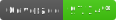

<p align="center">
  
  
  
 </p>

## Changelog Enforcer

<p align="center">


</p>

The purpose of this action is to enforce that every pull request in a repository includes a change to an ongoing changelog file. Inspired by [KeepAChangelog](https://keepachangelog.com/en/1.0.0/), this action helps development teams to keep a change file up to date as new features or fixes are implemented. 

### Usage

To use this action, follow the typical GitHub Action `uses` syntax. An example workflow using the default parameters of this action is shown below:

```yaml
name: "Pull Request Workflow"
on:
  pull_request:
    # The specific activity types are listed here to include "labeled" and "unlabeled"
    # (which are not included by default for the "pull_request" trigger).
    # This is needed to allow skipping enforcement of the changelog in PRs with specific labels,
    # as defined in the (optional) "skipLabels" property.
    types: [opened, synchronize, reopened, ready_for_review, labeled, unlabeled]

jobs:
  # Enforces the update of a changelog file on every pull request 
  changelog:
    runs-on: ubuntu-latest
    steps:
    - uses: dangoslen/changelog-enforcer@v3
```

Other examples can be seen in the [example-workflows](./example-workflows) directory in this repository.

_:warning: The Changelog Enforcer is designed to be used with the `pull_request` or `pull_request_target` event types. Using this action on any other event type will result in a warning logged and the action succeeding (as to not block the rest of a workflow)._

### Inputs / Properties

Below are the properties allowed by the Changelog Enforcer. These properties are shipped with sane defaults for typical use, especially for changelogs inline with the [KeepAChangelog](Keepachangelog.org) format.

#### `changeLogPath`
* Default: `CHANGELOG.md`
* The path to your changelog file. Should be from the perspective of the root directory to `git`. The file being checked for updates must be either an add (`A`) or modified (`M`) status to `git` to qualify as updated. 

#### `skipLabels` 
* Default: `'Skip-Changelog'` 
* List of labels used to skip enforcing of the changelog during a pull request. Each label name is comma separated and only one label needs to be present for enforcement to be skipped.

  For example, if `label-1,label-2` was supplied as the `skipLabels`, `label-1` _or_ `label-2` would skip the enforcer. Each label is trimmed for leading and trailing spaces since GitHub labels do not allow for leading or trailing spaces. Thus, the following lists are equivalent:
  * `label-1,label-2`
  * `label-1 , label-2`
  * `label-1  ,label-2`

#### `missingUpdateErrorMessage`
* Default: `''`
* Custom error message to use when no update to the changelog is found.

#### `expectedLatestVersion`
* Default: `''`
* The latest version of the software expected in the changelog. Should be in the form of `v1.1.0`, `v3.5.6` etc. Allows for the first version in the changelog to be an unreleased      version (either `unreleased|Unreleased|UNRELEASED`) before checking versions. If the only version in the changelog is an unreleased version, no validation occurs. This is to support a repository adding a changelog after other versions have been released and don't want to backport previous versions (though doing so is recommended).

#### `versionPattern`
* Default: `'## \\[((v|V)?\\d*\\.\\d*\\.\\d*-?\\w*|unreleased|Unreleased|UNRELEASED)\\]'`
* A regex pattern used to extract the version section headings from the changelog. The Changelog Enforcer assumes the use of the [KeepAChangelog.com](https://keepachangelog.com/en/1.0.0/) convention for section headings, and as such looks for a line starting with `## [version] - date`. Versions are only extracted from the changelog when enforcing the expected latest version (via the `expectedLatestVersion` property).

  If you supply your own regex to match a different format, your regex must match the version string as a capture group (in the default format, that's the part inside square brackets). The first capture group will be used if your regex includes multiple groups. The regex pattern is used with global and multiline flags to find all of the versions in the changelog.

  Because the regex is passed as a `String` object, you will need to escape backslash characters (`\`) via `\\`.

#### `token`
* Default: `${{ github.token }}`
* The token used to authenticate to the GitHub API. Uses the default token from the `github.token` context. Can be any access token you have  configured for your repository.

### Outputs

#### `errorMessage`
* The reason for why the Changelog Enforcer failed. Uses the `missingUpdateErrorMessage` property value if set when no update to the changelog is found.

### Creating Releases Automatically

Using this Action and the [Changelog Reader](https://github.com/mindsers/changelog-reader-action), plus a few standard GitHub created Actions, we can keep the changelog of a project up to date and create a GitHub release automatically with contents from the changelog. See this project's [release.yml](./.github/workflows/release.yml) for how to set up a simple workflow to create a new release based on a `VERSION` file and a changelog.
